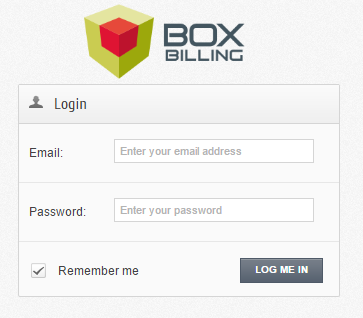
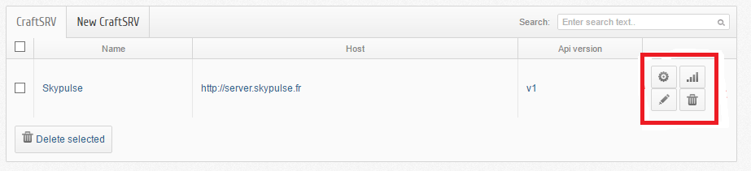
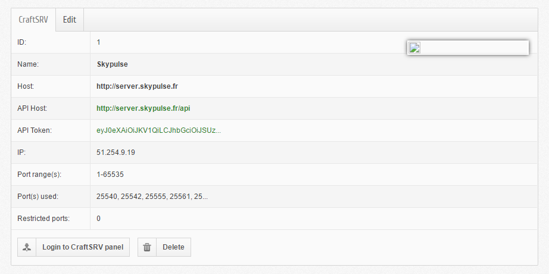
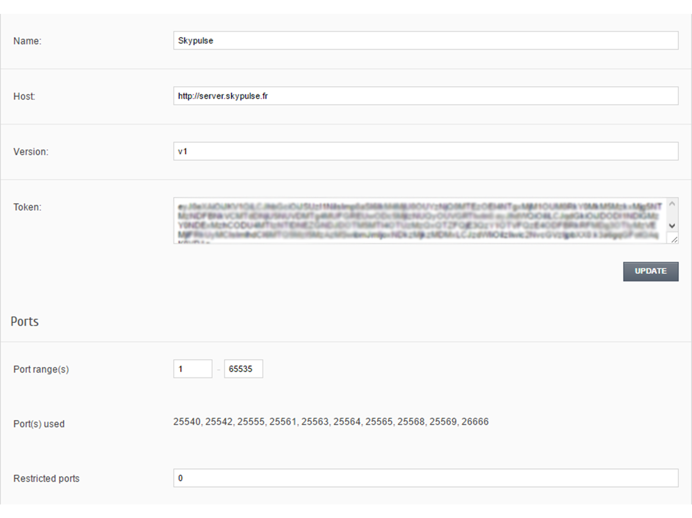
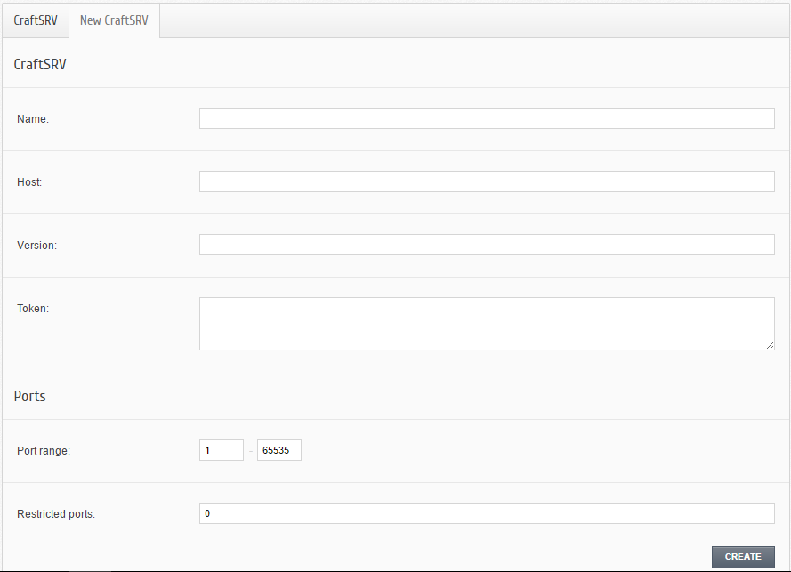

CraftSVR
********

Authentification
----------------
Pour s'authentifier il faut se rendre sur l'url : *url_du_boxbilling/index.php?_url=/bb-admin*.

Après vous logez avec votre **adresse éléctronique** et **mot de passe** en tant que admin afin d'installer le module.

Installation
------------
Dérouler le menu **Extensions -> Overview** puis il ne reste plus qu'à **activer** le **CraftSRV 0.1.0** en cliquant sur **Activate**.

On sera rédiriger directement vers l'url : *url_du_boxbilling/index.php?_url=/bb-admin/craftsrv*. Et c'est ici que vous pouvez gérer votre serveur machine. Oui, mais comment? 

Gestion des serveurs machines 
-----------------------------
Pour gérer ses serveurs, il faut aller dans l'onglet **CraftSRV -> Overview**.
Et sur le coin à doite,  on observe, respectivement le **paneau de configuration du host** (par exemple, ici le host est, skypulse), le bouton permettant de **tester si on est connécté ou pas** et finalement un **bouton d'édition** le tout illustrés sur la figure suivante (encadré en rouge).

La page d'édition
^^^^^^^^^^^^^^^^^^^
Lorsque vous cliquez sur le bouton éditer, vous aurez

Premièrement, on peut voir plein d'information apropos du serveur machine comme l'adresse **IP** du serveur à créer ainsi que les ports déjà ocuppés, pour ne citer que cela. 

Aussi, c'est ici qu'on a la possibilité d'éditer le **nom**, **l'hôte**, la **version** , le **token** et les **ports** du serveur machine en question en allant dans l'onglet **Edit** comme nous montre la figure suivante. 

Après modiffication souhaitée, cliquer sur **UPDATE** et tout sera enregistre avec ce que vous viens de modiffier.

Tout ceci est beau mais où est-ce qu'on peut créer ces serveurs?

Ajout des serveurs machines
---------------------------
Vous pouvez facilement ajouter une nouvrelle serveur machine ! Rendez vous dans le menu **CraftSRV -> Overview** après cliquer sur l'onglet **New CraftSRV** .

Un formulaire qui comprend **6 champs** apparaît.

Completez les **4 premiers champs obligatoires** avec :

- Le **nom** du serveur machine
- **L'hôte** du serveur lors de l' achat de celui-ci au `GamePanelioAPI <https://docs.gamepanel.io/api/>`_ .
- La **version** de l'API courant qu'on peut voir `ici <http://docs.gamepanel.io/api>`_ .
- et le **Token** qui n'est autre que le jeton renvoyé par le serveur machine (comme skypulse par exemple).

et les **2 champs facultatifs** avec :

- une plage de **port**
- **les ports** qu'on veut *interdir* (on les sépare par des virgules dans le cas où il y en a plusierus)

Cliquer sur le bouton **CREATE** et le servuer machine sera créer avec succès et on le trouve apparaît sur la liste des serveurs à cet url : *url_du_boxbilling/index.php?_url=/bb-admin/craftsrv* où on peut les configurer.