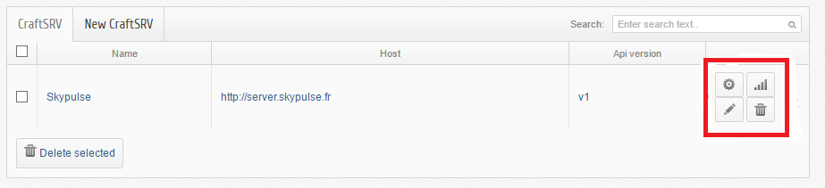
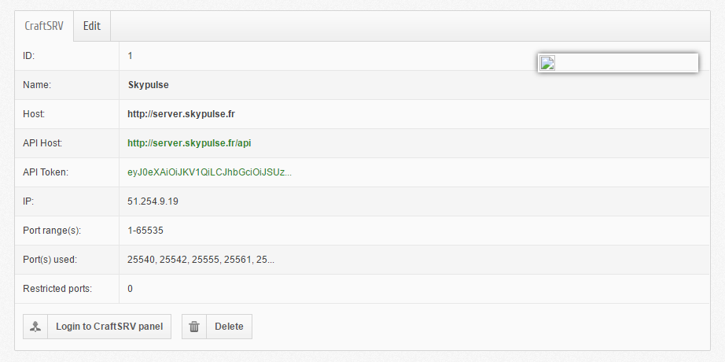
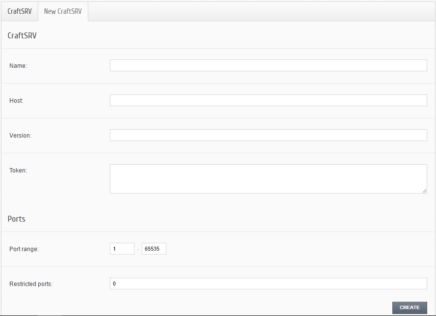
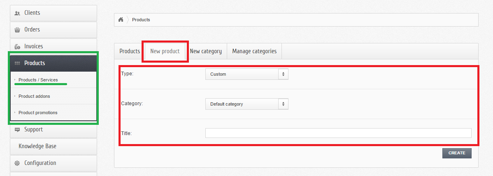

Bienvenu sur la documentation du module Boxbilling CraftSRV !
****************************************************************
Il s'agit d'un module **d'hébergement** utilisant le plateforme de service **SaaS** `GamePanelioAPI <https://docs.gamepanel.io/api/>`_ dans le but de créer des **serveurs** dans des `CraftSVR <https://gamepanel.atlassian.net/wiki/spaces/CSRV>`_ version 1.x.

Manuel d'utilisation
********************

Back office
===========

Authentification
----------------
Pour s'authentifier il faut se rendre sur l'url : *url_du_boxbilling/index.php?_url=/bb-admin*.
Après on loge avec l'adresse éléctronique et le mot de passe en tant que admin.

Installation (serveur machine)
------------------------------
Dérouler l'onglet **Extensions** ensuite cliquer **Overview** puis il ne reste plus qu'à **activer** le **CraftSRV 0.1.0**.
On sera rédiriger directement vers l'url : *url_du_boxbilling/index.php?_url=/bb-admin/craftsrv*. Et c'est ici que vous pouvez gérer votre serveur machine. Oui, mais comment? 

Gestion des serveurs machines 
-----------------------------
Pour gérer ses serveurs, il faut aller dans l'onglet **CraftSRV** puis cliquer sur **Overview**.
Et sur le coin à doite,  on observe, succéssivement le **paneau de configuration du host** (par exemple, ici le host est, skypulse), le bouton permettant de **tester si on n'est pas connécté ou pas** et finalement un **bouton d'édition** illustrés sur la figure suivante (encadré en rouge).

Le bouton d'édition
^^^^^^^^^^^^^^^^^^^
Lorsque vous cliquez sur le bouton éditer, vous aurez

Premièrement, on peut voir plein d'information apropos du serveur machine comme l'adresse **IP** du serveur à créer ainsi que les ports déjà ocuppés, pour ne citer que cela. 

Aussi, c'est ici qu'on a la possibilité d'éditer le **nom**, **l'hôte**, la **version** , le **token** et les **ports** du serveur machine en question en allant dans l'onglet **Edit** comme nous montre la figure suivante. 

.. image:: imgs/image-3.PNG
   :align: center

Où est-ce qu'on peut créer ces serveurs?

Ajout des serveurs machines
---------------------------
Vous pouvez facilement ajouter une nouvrelle serveur machine en allant dans l'onglet **CraftSRV** puis **Overview** après cliquer sur **New CraftSRV** .
Un formulaire qui comprend **6 champs** apparaît.

Completez les **4 champs obligatoires** avec :

- Le nom du serveur machine
- L'hôte du serveur lors de l' achat de celui-ci au `GamePanelioAPI <https://docs.gamepanel.io/api/>`_ .
- La version de l'API courant qu'on peut voir `ici <http://docs.gamepanel.io/api>`_ .
- et le Token qui n'est autre que le jeton renvoyé par le serveur machine (comme skypulse par exemple).

et les **2 champs facultatifs** avec :

- une plage de port
- les ports qu'on veut interdir (on les sépare par des virgules dans le cas où il y en a plusierus)

Cliquer sur le bouton **CREATE** et le servuer machine sera créer avec succès et on le trouve apparaît sur la liste des serveurs à cet url : *url_du_boxbilling/index.php?_url=/bb-admin/craftsrv* où on peut les configurer.

Installation des produits serveurs
----------------------------------
Pour cela, il suffit d'aller dans l'onglet **Extensions** puis **Overview**, comme précédemnt lors de l'installation d'un serveur machine, mais cette fois-ci on **active** le serveur **Server CraftSRV product type 0.1.0**. 

Ajout des produits serveurs de types GameCraftSRV
-------------------------------------------------
Il faut se rendre dans l'onglet **Products** ensuite **Products & Services** (encadré et souligné en vert) puis **New Product** (encadré en rouge).
Et là,  il y a **trois champs** à remplir (encadré en rouge) à savoir : 

- Le type du produit 
- sa catégorie
- enfin, son nom.

Il ne reste plus qu'à valider en appuyant sur le bouton **CREATE**, puis vous serrez face à une interface permettant de paramétrer d'une manière générale le produit et quelques configurations comme : 

- Le choix du serveur machine 
- Le choix du game
- Et le Hosting Plan

Front office
============

Authentification en tant que client
-----------------------------------

Achats des produits de type gameCraftSRV
----------------------------------------