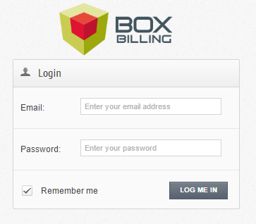
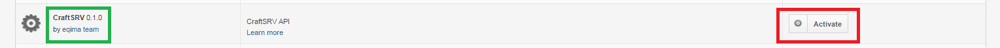
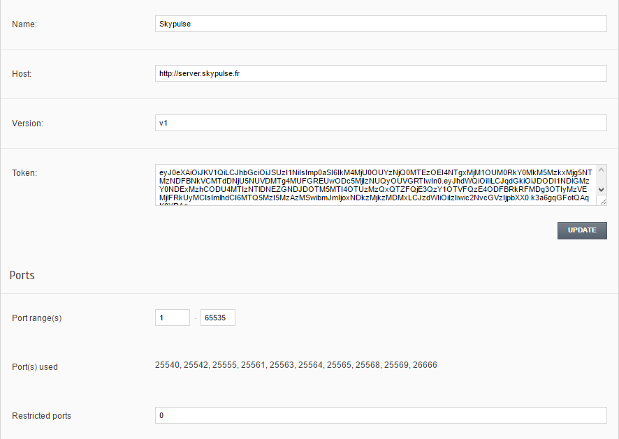
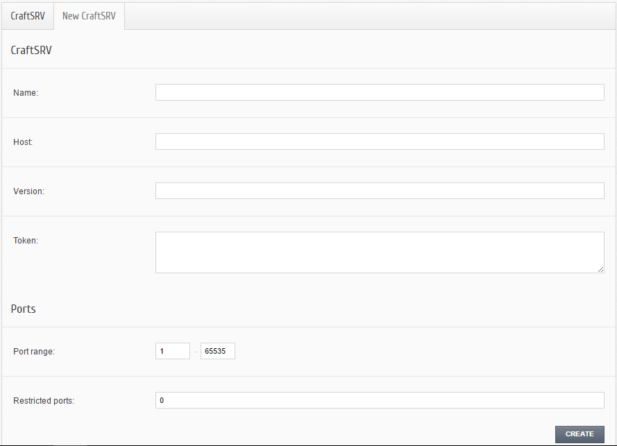
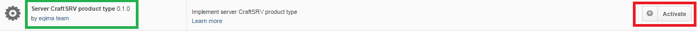
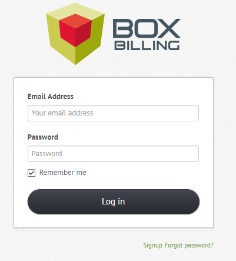
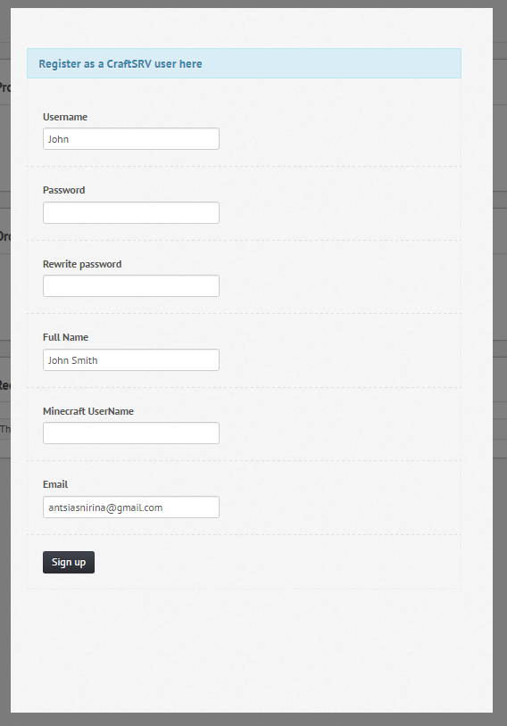
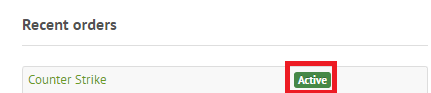

Bienvenue sur la documentation du module Boxbilling CraftSRV !
****************************************************************
Il s'agit d'un module **d'hébergement** utilisant le plateforme de service **SaaS** `GamePanelioAPI <https://docs.gamepanel.io/api/>`_ dans le but de créer des **serveurs** dans des `CraftSVR <https://gamepanel.atlassian.net/wiki/spaces/CSRV>`_ version 1.x.

Manuel d'utilisation
********************

Back office
===========

Authentification
----------------
Pour s'authentifier il faut se rendre sur l'url : *url_du_boxbilling/index.php?_url=/bb-admin*.

Après vous logez avec votre **adresse éléctronique** et **mot de passe** en tant que admin.

Installation (serveur machine)
------------------------------
Dérouler le menu **Extensions -> Overview** puis il ne reste plus qu'à **activer** le **CraftSRV 0.1.0** en cliquant sur **Activate**.

On sera rédiriger directement vers l'url : *url_du_boxbilling/index.php?_url=/bb-admin/craftsrv*. Et c'est ici que vous pouvez gérer votre serveur machine. Oui, mais comment? 

Gestion des serveurs machines 
-----------------------------
Pour gérer ses serveurs, il faut aller dans l'onglet **CraftSRV -> Overview**.
Et sur le coin à doite,  on observe, respectivement le **paneau de configuration du host** (par exemple, ici le host est, skypulse), le bouton permettant de **tester si on est connécté ou pas** et finalement un **bouton d'édition** le tout illustrés sur la figure suivante (encadré en rouge).

.. image:: imgs/Back-office/image-1.PNG
   :align: center

La page d'édition
^^^^^^^^^^^^^^^^^^^
Lorsque vous cliquez sur le bouton éditer, vous aurez

.. image:: imgs/Back-office/image-2.PNG
   :align: center

Premièrement, on peut voir plein d'information apropos du serveur machine comme l'adresse **IP** du serveur à créer ainsi que les ports déjà ocuppés, pour ne citer que cela. 

Aussi, c'est ici qu'on a la possibilité d'éditer le **nom**, **l'hôte**, la **version** , le **token** et les **ports** du serveur machine en question en allant dans l'onglet **Edit** comme nous montre la figure suivante. 

Après modiffication souhaitée, cliquer sur **UPDATE** et tout sera enregistre avec ce que vous viens de modiffier.

Tout ceci est beau mais où est-ce qu'on peut créer ces serveurs?

Ajout des serveurs machines
---------------------------
Vous pouvez facilement ajouter une nouvrelle serveur machine ! Rendez vous dans le menu **CraftSRV -> Overview** après cliquer sur l'onglet **New CraftSRV** .

Un formulaire qui comprend **6 champs** apparaît.

Completez les **4 premiers champs obligatoires** avec :

- Le **nom** du serveur machine
- **L'hôte** du serveur lors de l' achat de celui-ci au `GamePanelioAPI <https://docs.gamepanel.io/api/>`_ .
- La **version** de l'API courant qu'on peut voir `ici <http://docs.gamepanel.io/api>`_ .
- et le **Token** qui n'est autre que le jeton renvoyé par le serveur machine (comme skypulse par exemple).

et les **2 champs facultatifs** avec :

- une plage de **port**
- **les ports** qu'on veut *interdir* (on les sépare par des virgules dans le cas où il y en a plusierus)

Cliquer sur le bouton **CREATE** et le servuer machine sera créer avec succès et on le trouve apparaît sur la liste des serveurs à cet url : *url_du_boxbilling/index.php?_url=/bb-admin/craftsrv* où on peut les configurer.

Installation des produits serveurs
----------------------------------
Pour cela, il suffit d'aller dans  **Extensions -> Overview**, comme précédemnt lors de l'installation d'un serveur machine, mais cette fois-ci on **active** le serveur **Server CraftSRV product type 0.1.0** en cliquant sur **Activate**. 

Ajout des produits serveurs de types GameCraftSRV
-------------------------------------------------
Il faut se rendre dans **Products -> Products & Services** (encadré et souligné en vert) puis cliquer l'onglet **New Product** (encadré en rouge).

Et là,  il y a **trois propriétés** à spécifier (encadré en rouge) : 

- Une liste déroulante permettant de choisir **le type du produit**, 
- idem pour sa catégorie
- enfin, un champ pour le **nom** du produit.

.. image:: imgs/Back-office/image-4.PNG
   :align: center

Il ne reste plus qu'à valider en appuyant sur le bouton **CREATE**, puis vous serrez face à une interface permettant de paramétrer d'une manière générale le produit et quelques configurations comme : 

- Le choix du serveur machine 
- Le choix du game
- Et le Hosting Plan

Front office
============

Authentification en tant que client
-----------------------------------
Pour s'authentifier en tant que client, il va falloir se rendre à cet url : *http://197.158.86.184:8080/boxbilling/index.php?_url=/login*.

Entrez **l'adresse éléctronique** et le **mot de passe** en tant que client et cliquez sur **Log in**.

Maintenant, vous pouvez commander des produits configurations serveurs de type gameCraftSRV !

Achats des produits de type gameCraftSRV
----------------------------------------
Pour ce faire, cliquer sur le bouton **New Order**. Vous verez après les listes des différents produits configurations serveurs de type GameCraft.

.. image:: imgs/Front-office/image-02.PNG
   :align: center

Selectionner un produit de type gameCraftSRV ! Mais 2 cas peuvent se présenter si vous avez déjà un compte CraftSRV ou pas.

Le client n'a pas de compte CraftSRV
^^^^^^^^^^^^^^^^^^^^^^^^^^^^^^^^^^^^
Evidemment, il va falloire en créer un. Pour cela, cliquer sur le lien *Register as a CraftSRV user*.

Vous serez face à cet formulaire :

Remplissez tous ces informations et faites **Sing up** et le compte sera créer! Vous pouvez ensuite passer au payement.

Le client a déjà un compte CraftSRV
^^^^^^^^^^^^^^^^^^^^^^^^^^^^^^^^^^^
Dans ce cas, lors d'un séléction d'un produit de type GameCraft pour le commander vous devrez indiquer le **nom du serveur** (*Server name* en anglais) commme suit :

.. image :: imgs/Front-office/image-05.PNG
   :align: center

Ensuite, cliquer sur **Order**, puis **checkout** enfin vous faites le **payement**.

Que vous avez déjà un compte ou pas, si tout se déroule très bien comme il faut vous devrez avoir un **Active** en vert à côté de votre produit de type GameCraft(cela signifie autrement que vous l'avez bien payé !!) comme sur la figure suivante.

