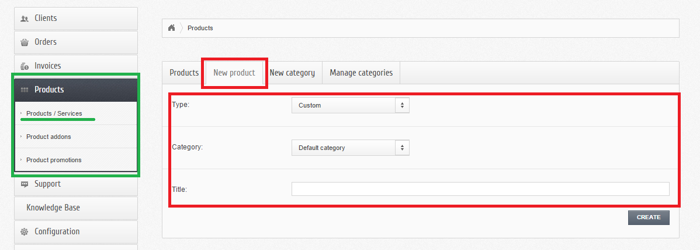
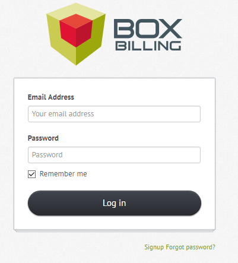
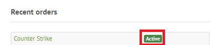

ServiceCraftSVR
***************

Installation des produits serveurs
----------------------------------
Pour cela, il suffit d'aller dans  **Extensions -> Overview**, comme précédemnt lors de l'installation d'un serveur machine, mais cette fois-ci on **active** le serveur **Server CraftSRV product type 0.1.0** en cliquant sur **Activate**. 

.. image:: imgs/Back-office/image-32.PNG
   :align: center

Ajout des produits serveurs de types GameCraftSRV
-------------------------------------------------
Il faut se rendre dans **Products -> Products & Services** (encadré et souligné en vert) puis cliquer l'onglet **New Product** (encadré en rouge).

Et là,  il y a **trois propriétés** à spécifier (encadré en rouge) : 

- Une liste déroulante permettant de choisir **le type du produit Gamecraftsrv**, 
- idem pour sa catégorie
- enfin, un champ pour le **nom** du produit.

Il ne reste plus qu'à valider en appuyant sur le bouton **CREATE**, puis vous serrez face à une interface permettant de paramétrer d'une manière générale le produit et quelques configurations comme : 

- Le choix du serveur machine 
- Le choix du game
- Et le Hosting Plan

Authentification en tant que client
-----------------------------------
Pour s'authentifier en tant que client, il va falloir se rendre à cet url : *http://197.158.86.184:8080/boxbilling/index.php?_url=/login*.

Entrez **l'adresse éléctronique** et le **mot de passe** en tant que client et cliquez sur **Log in**.

Maintenant, vous pouvez commander des produits configurations serveurs de type GameCraftSRV !

Achats des produits de type gameCraftSRV
----------------------------------------
Pour ce faire, cliquer sur le bouton **New Order**. Vous verez après les listes des différents produits.

.. image:: imgs/Front-office/image-02.PNG
   :align: center

Selectionner un produit de type gameCraftSRV ! Mais 2 cas peuvent se présenter si vous avez déjà un compte CraftSRV ou pas.

Le client n'a pas de compte CraftSRV
^^^^^^^^^^^^^^^^^^^^^^^^^^^^^^^^^^^^
Evidemment, il va falloire en créer un. Pour cela, cliquer sur le lien *Register as a CraftSRV user*.

Vous serez face à cet formulaire :

.. image:: imgs/Front-office/image-04.PNG
   :align: center

Remplissez tous ces informations et faites **Sing up** et le compte sera créer! Vous pouvez ensuite passer au payement.

Le client a déjà un compte CraftSRV
^^^^^^^^^^^^^^^^^^^^^^^^^^^^^^^^^^^
Dans ce cas, lors d'un séléction d'un produit de type GameCraft pour le commander vous devrez indiquer le **nom du serveur** (*Server name* en anglais) commme suit :

.. image :: imgs/Front-office/image-05.PNG
   :align: center

Ensuite, cliquer sur **Order**, puis **checkout** enfin vous faites le **payement**.

Que vous avez déjà un compte ou pas, si tout se déroule très bien comme il faut vous devrez avoir un **Active** en vert à côté de votre produit de type GameCraft(cela signifie autrement que vous l'avez bien payé !!) comme sur la figure suivante.

